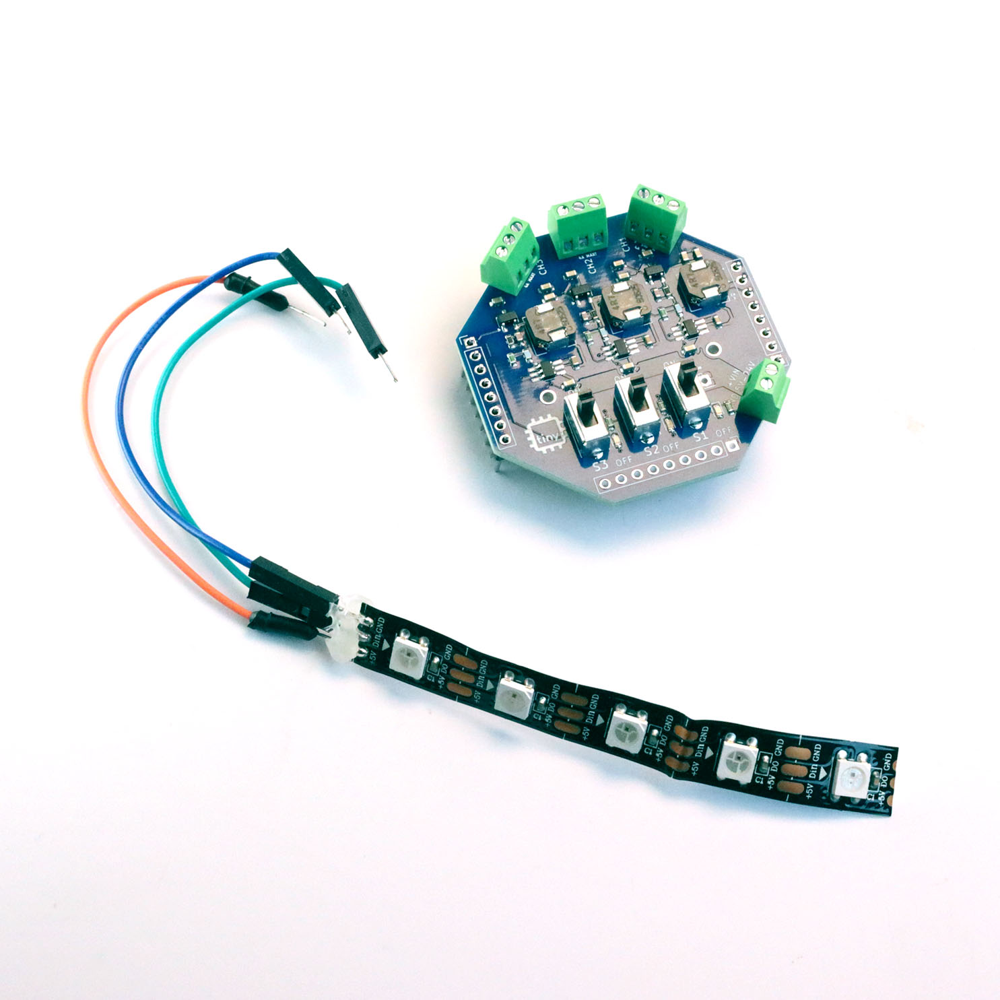

# tinyGlow — Perma-protoboard HAT for tinyCore ESP32-S3

**A perma-protoboard (soldered breadboard) for the [tinyCore](https://github.com/Mister-Industries/tinyCore) ESP32-S3 platform.**

[Purchase](https://tinycore.cc/store/products/tinyGlow) · [Discord](https://discord.gg/hvJZhwfQsF) · [Documentation](https://docs.mr.industries)

---

### How to open the Schematic (KiCAD)

The tinyGlow design files are provided as a KiCAD project. KiCAD is a free, open-source PCB design tool.

To open the files:
1. Download and install [KiCAD](https://www.kicad.org/download/) (version 7.0 or later recommended).
2. Open KiCAD and click **File > Open Project** (or press Ctrl+O).
3. Navigate to the Hardware folder of this repository and select the `.kicad_pro` project file.
4. Once the project opens, you can access:
   - **Schematic Editor** - Double-click the `.kicad_sch` file to view the circuit design
   - **PCB Editor** - Double-click the `.kicad_pcb` file to view the board layout

The project will open with all associated files (schematic, PCB, and libraries) ready to view and edit.
